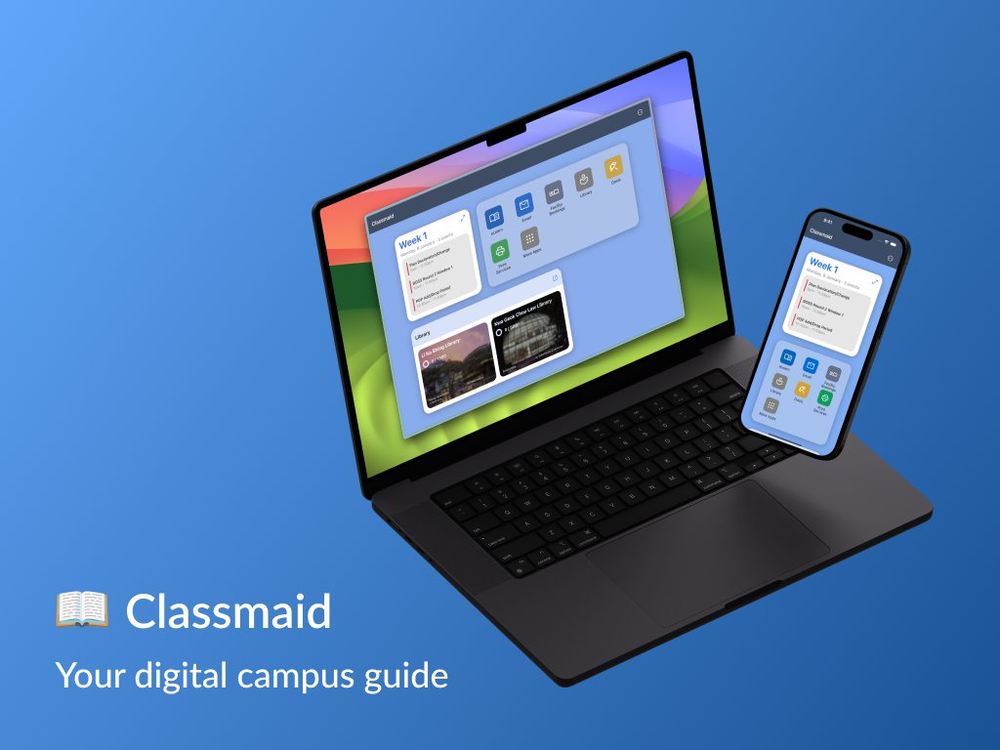

<p align="center" style="background-color: #FAFAFA;">
    
    <h1 align="center">Classmaid</h1>
</p>

<h4 align="center">
  A one-click access to commonly-used websites in educations. </br>
  This site is non-affliated with any Singapore-based schools.
</h4>

---

<p align="center">
  
</p>

---

## 💻 Try it

Visit [Classmaid.sg](https://www.classmaid.sg)

## 🤩 Features

- Bookmarks of commonly-used websites used by schools
- View upcoming school events
- View current school term event

## 🛠 Develop

Run the following commands:

```bash
# Clone the repo
git clone https://github.com/alphatrl/classmaid.git && cd classmaid

# Install dependencies
yarn install

# Copy the env.example files
cp .env.example .env

# Run the app (Development)
yarn dev

# Run the app (Production)
yarn build
yarn start
```

Open [http://localhost:3000](http://localhost:3000) to view it in the browser.

### 💾 Data

The data used by SMU-Shortcuts is stored in [smu-scraper](https://github.com/foldaway/smu-scraper)

## 🙋 Contribute

If you found a bug, or if you have an idea for this app, please [file an issue here](https://github.com/alphatrl/classmaid/issues). We appreaciate your feedbacks and inputs.

## 📜 License

MIT License. See [LICENSE](./LICENSE) file for more information.

## ⭐️ Credits

Created by [Amos](http://github.com/alphatrl)

A huge thanks to the following contributers for their amazing work:

[](https://github.com/duncanleo)
[](https://github.com/chesterhow)
